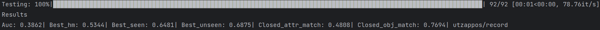

# Compositional Zero-Shot Learning
This is the PyTorch code of 2024 works [Fusing Spatial-Frequency Features for Compositional Zero-Shot Image Classification](https://www.sciencedirect.com/science/article/abs/pii/S0957417424020979) (accepted). 
The code provides the detailed implementation of SFFNet, and we also provide the model weights for validation.

<p align="center">
  
</p>

## Setup
1. Clone the code. 

2. Please prepare the datasets and the necessary configuration files before you start. The organization procedure can be referred to: [CGE](https://github.com/ExplainableML/czsl)

3. We recommend using Anaconda for environment setup. We export the environments we used for simplicity:

```
    conda env create --file environment.yml
    conda activate sffnet
```

## Quick Validation

We save the training weights of our model in folder `validation`, and the final results
presented in the paper can be tested by the [weights](https://drive.google.com/drive/folders/1FLUavllgIZupk5rSVl_wabz4iWDLE330?usp=drive_link).
The pre-trained weights of frequency feature encoder GFNet-H-Ti
can be downloaded from [GFNet](https://github.com/raoyongming/GFNet), 
we also prepare a [duplicate](https://drive.google.com/file/d/1sPeKcn0QoANiyaxvBVBTYGgwuuFXAsmE/view?usp=drive_link).  
**Note**: make sure your download files are organized as follows,
```
SFFNet_czsl
    └─ configs
    │     └─... 
    └─ data  
    │   └─cgqa
    │   │  └─compositional-split-natural
    │   │  └─images
    │   └─ut-zap50k
    │   │    └─compositional-split-natural
    │   │    └─images
    │   │    └─metadata_compositional-split-natural.t7
    │   └─mit-states
    │      └─compositional-split-natural
    │      └─images
    │      └─metadata_compositional-split-natural.t7
    └─ models
    │     └─... 
    └─ validation
    │     └─cgqa
    │     │   └─cgqa.yml
    │     │   └─ckpt_best_auc.t7
    │     └─mit
    │     │   └─mit.yml
    │     │   └─ckpt_best_auc.t7
    │     └─utzappos
    │        └─utzappos.yml
    │        └─ckpt_best_auc.t7   
    └─...           
``` 
Take UT-Zappos50k for example:

```
    python test.py --logpath ./validation/utzappos/
```
<p align="center">
  
</p>

## Training
If you want to train the model, please open the terminal and run:

```
    python train.py --config CONFIG_FILE
```
where `CONFIG_FILE` is the path to the configuration file of the model. 
The folder `configs` contains configuration files for all methods,
i.e. `configs/utzappos.yml`, `configs/mit.yml`, and `configs/cgqa.yml`,

For example, if you want to train on UT-Zappos50k, the command is:
```
    python train.py --config configs/cge/utzappos.yml
```

## Test

To test your trained model, the code is simple:
```
    python test.py --logpath LOG
```
where `LOG` is your directory containing the logs of a model.


## Acknowledgement
Our code is based on the following excellent projects. Please consider citing:
  
*[CGE](https://github.com/ExplainableML/czsl)
  
*[GFNet](https://github.com/raoyongming/GFNet)
  
*[DFSP](https://github.com/Forest-art/DFSP)
